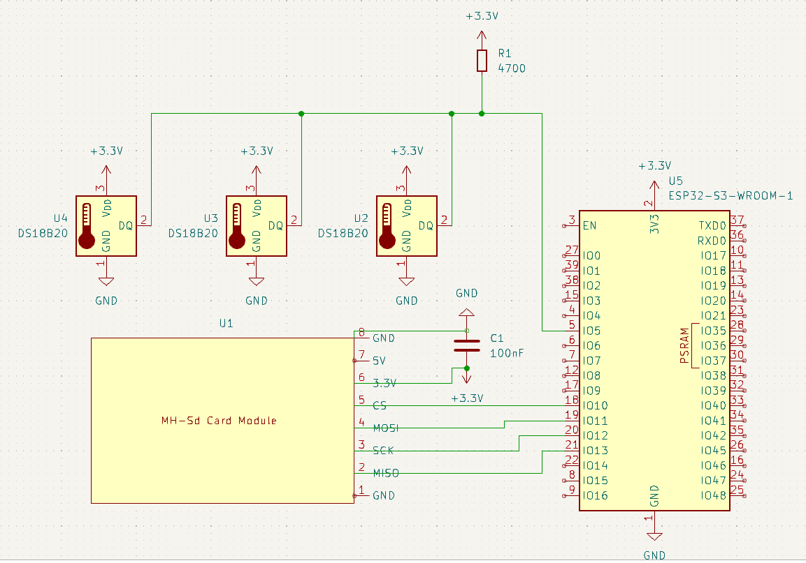

Climate Battery Greenhouse Control Core

This repository contains the control logic, hardware schematics, and custom KiCad symbols for an automated Climate Battery Greenhouse (CBGH) controller.
The system is designed to capture daytime excess heat inside a greenhouse and store it underground, then release it back during the night to stabilize temperatures and reduce energy loss.

The controller is built around an ESP32‑S3‑WROOM microcontroller, multiple DS18B20 temperature sensors, and a Shelly Plug S smart outlet for fan control.
All environmental data and system states are logged locally to an SD card via an SPI‑based SD module.

Project Motivation

Greenhouses often suffer from a simple but costly problem:

    Too hot during the day → excess heat wasted

    Too cold during the night → heat escapes quickly due to poor insulation

A climate battery solves this by using the soil beneath the greenhouse as a thermal mass.
This project provides the automation layer that makes the climate battery work efficiently without human intervention.

The goal is to maximize heat recovery, minimize nighttime heat loss, and maintain stable growing conditions using inexpensive hardware and local‑network control.

System Overview

The greenhouse contains a buried network of perforated drainage pipes.
A fan connected to a Shelly Plug S moves air through these pipes, enabling heat transfer between the greenhouse air and the soil.

The controller decides when to run the fan based on temperature differentials:
Daytime (Heat Storage Mode)

If greenhouse air temperature is higher than the soil temperature:
→ The fan turns ON  
→ Warm air is pushed underground
→ Heat is stored in the soil via conduction
Nighttime (Heat Release Mode)

If greenhouse air temperature is lower than the soil temperature:
→ Heat naturally conducts upward
→ The fan may turn ON to accelerate reverse heat transfer
→ The greenhouse receives stored warmth
Soil Conservation Mode

If soil temperature approaches its natural baseline (~10°C):
→ The system avoids active cooling
→ The goal becomes preserving the soil’s thermal mass
Hardware Components/ sensors.h — DS18B20 sensor interface. Reads greenhouse air, soil, and outdoor temperatures.

    ESP32‑S3‑WROOM  
    Main controller handling sensor input, logic, WiFi communication, and SD logging.

    DS18B20 Temperature Sensors

        Sensor 1: Greenhouse air temperature

        Sensor 2: Soil / climate battery temperature

        Sensor 3: Outdoor air temperature
        Temperature differences between sensors drive the control logic.

    Shelly Plug S  
    Controls the fan via local WiFi (no cloud dependency).
    The ESP32 sends ON/OFF commands based on thermal conditions.

    SD Card Module (SPI)  
    Logs:

        All temperature readings

        Fan state (ON/OFF)

        Timestamp
        Logging interval: 15 minutes

    Weatherproof enclosure  
    Protects the electronics inside the greenhouse environment.

Schematic

Data Logging

Every 15 minutes, the system writes a structured log entry to the SD card containing:

    Greenhouse temperature

    Soil temperature

    Outdoor temperature

    Fan state

    Timestamp

This enables long‑term analysis of:

    Heat storage efficiency

    Nighttime heat release

    Seasonal soil temperature behavior

    Fan duty cycles

Control Logic Summary

The ESP32 continuously evaluates:

    ΔT = GreenhouseTemp − SoilTemp

Fan behavior:

    ΔT > 2 → store heat → fan ON

    ΔT < 4 → release heat → fan ON (conditional)

    SoilTemp near 13°C → conserve soil heat → fan OFF

    OutdoorTemp used for contextual decisions

All decisions are made locally without cloud services.

Repository Contents
    CBGH_control_core.ino — Main Arduino/ESP32 application. Handles system initialization, sensor polling, decision logic, WiFi communication, and SD logging.

    data_logger.cpp / data_logger.h — SD card logging module. Writes temperature data, fan state, and timestamps at fixed intervals.

    fan_control.cpp / fan_control.h — Controls the Shelly Plug S over local WiFi. Provides ON/OFF logic based on thermal conditions.

    sensors.cpp / sensors.h — DS18B20 sensor interface. Reads greenhouse air, soil, and outdoor temperatures.

    KiCad schematic (.kicad_sch)

    Custom symbol libraries (.kicad_sym)

    Supporting KiCad configuration files

Installation & Deployment

The controller is installed inside a weatherproof box mounted within the greenhouse.
Sensors are routed to their respective measurement points, and the fan is connected through the Shelly Plug S.

Firmware runs on the ESP32‑S3 and communicates with the Shelly device over the local WiFi network.
Status

This project is under active development.
Hardware schematics and custom KiCad symbols are included for reproducibility and future PCB design.
